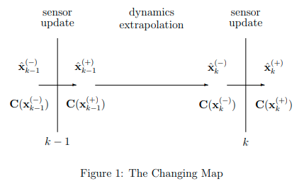

# [Paper Review] Estimating Uncertain Spatial Relationships in Robotics

Estimating Uncertain Spatial Relationships in Robotics

Smith R., Self M., Cheeseman P. (1990) Estimating Uncertain Spatial Relationships in Robotics. In: Cox I.J., Wilfong G.T. (eds) Autonomous Robot Vehicles. Springer, New York, NY

\\
SLAM 수업 들으면서 초반에 나오는 논문인데, 로봇 이동간에 coordinate system의 변화에 따라 Covarinace matrix가 어떻게 Propagation 되는지 잘 설명해주는 논문인 것 같다.

## Abstract

In this paper, we describe a representation for spatial information, called the stochastic map, and associated procedures for building it, reading information from it, and revising it incrementally as new information is obtained. The map contains the estimates of relationships among objects in the map, and their uncertainties, given all the available information. The procedures provide a general solution to the problem of estimating uncertain relative spatial relationships. The estimates are probabilistic in nature, an advance over the previous, very conservative, worst-case approaches to the problem. Finally, the procedures are developed in the context of state-estimation and filtering theory, which provides a solid basis for numerous extensions.

## The Stochastic Map
`` In this paper, uncertain spatial relationships will be tied together in a representation called the _stochastic map_.

### Representations

Spatial variable (x coordinate, y coordinate, yaw) (2D):

$$\mathbf{x} = \begin{bmatrix} x \\ y \\ \phi \end{bmatrix} $$ 

Probability distribution :

$$ P(\mathbf{x}) = f(\mathbf{x})d\mathbf{x}$$

Mean :

$$\hat{\mathbf{x}} \overset{\Delta}{=} E(\mathbf{x}) = \begin{bmatrix} \hat{\mathbf{x}} \\ \hat{\mathbf{y}} \\ \hat{\mathbf{\phi}} \end{bmatrix} $$

Error :

$$\tilde{\mathbf{x}} \overset{\Delta}{=} \mathbf{x} - \hat{\mathbf{x}}$$

Covariance :

$$ \mathbf{C(x)} \overset{\Delta}{=} E(\tilde{\mathbf{x}}\tilde{\mathbf{x}}^{T}) = 
\begin{bmatrix}
\sigma_x^2 && \sigma_{xy} && \sigma{x\phi} \\
\sigma_{yx} && \sigma_{y}^2 && \sigma_{y\phi}\\
\sigma_{\phi x} && \sigma_{\phi y} && \sigma_{\phi}^2
\end{bmatrix}
$$

Correlation coefficients :

$$\rho_{ij} \overset{\Delta}{=} \frac{\sigma_{ij}}{\sigma_i \sigma_j} = \frac{E(\tilde{x_i}\tilde{x_j})}{\sqrt{E(\tilde{x_i}^2)E(\tilde{x_j}^2)}}$$ 

where $$-1 <=\rho_{ij} <= 1$$

State vector and mean of state vectors:

$$\mathbf{x} = \begin{bmatrix} \mathbf{x}_1 \\ \vdots \\ \mathbf{x}_n \end{bmatrix}, \hat{\mathbf{x}} = \begin{bmatrix} \hat{\mathbf{x}_1} \\ \vdots \\ \hat{\mathbf{x}_n} \end{bmatrix}$$

State vector covariance :

$$ \mathbf{C(x)} = \begin{bmatrix}
\mathbf{C}(\mathbf{x}_1) && \mathbf{C}(\mathbf{x}_1, \mathbf{x}_2)&& \dots && \mathbf{C}(\mathbf{x}_1, \mathbf{x}_n)\\
\mathbf{C}(\mathbf{x}_2, \mathbf{x}_1) && \mathbf{C}(\mathbf{x}_2) && \dots && \mathbf{C}(\mathbf{x}_2, \mathbf{x}_n)\\
\vdots && \vdots && \ddots && \vdots\\
\mathbf{C}(\mathbf{x}_n, \mathbf{x}_1) && \mathbf{C}(\mathbf{x}_n, \mathbf{x}_2) && \dots && \mathbf{C}(\mathbf{x}_n)
\end{bmatrix}
$$

where

$$ \mathbf{C}(\mathbf{x}_i, \mathbf{x}_j) \overset{\Delta}{=} E(\tilde{\mathbf{x}}_i, \tilde{\mathbf{x}}_j)
\\
\mathbf{C}(\mathbf{x}_i, \mathbf{x}_j) = \mathbf{C}(\mathbf{x}_i, \mathbf{x}_j)^T $$

and with centeral limit theorem, resulting distribution will be as in Gaussian:

$$P(\mathbf{x}) = 
\frac{exp([-\frac{1}{2}(\mathbf{x} - \hat{\mathbf{x}})^T\mathbf{C}^{-1}(\mathbf{x})(\mathbf{x} - \hat{\mathbf{x}})])}
{\sqrt{(2\pi)^m|\mathbf{C}(\mathbf{x})|}}d\mathbf{x}$$

여기서 $$m$$ 은 $$\mathbf{x}$$의 dimension

## Reading the Map

### Uncertain Relationship

#### Linear Relationships

$$ \mathbf{y} = \mathbf{Mx} + \mathbf{b}
\\
\hat{\mathbf{y}} = \mathbf{M}\hat{\mathbf{x}} + \mathbf{b} $$

Covariance

$$ \mathbf{C}(\mathbf{y}) = \mathbf{MC}(\mathbf{x})\mathbf{M}^T
\\
\mathbf{C}(\mathbf{y}, \mathbf{z}) = \mathbf{MC}(\mathbf{x}, \mathbf{z})
\\
\mathbf{C}(\mathbf{z}, \mathbf{y}) = \mathbf{C}(\mathbf{z}, \mathbf{x})\mathbf{M}^T $$

이들은 Covariance matrix의 계산방법 ($$\mathbf{C}(\mathbf{y}) = E((\mathbf{y}-\hat{\mathbf{y}})(\mathbf{y}-\hat{\mathbf{y}})^T), \mathbf{C}(x,y) = E((\mathbf{x}-\hat{\mathbf{x}})(\mathbf{y}-\hat{\mathbf{y}})^T)$$)를 따라가면 쉽게 유도할 수 있다.

#### Nonlinear Relationships

$$ \mathbf{y} = \mathbf{f}(\mathbf{x}) $$

Taylor series expansion about esimtated mean $$\hat{\mathbf{x}} $$

$$ \mathbf{y} = \mathbf{f}(\hat{\mathbf{x}}) + \mathbf{F_x}\tilde{\mathbf{x}} + \dots  $$

where $$\mathbf{F_x} $$ is the matrix of partials, or Jacobian of $$\mathbf{f}$$ evaluated at $$\hat{\mathbf{x}}$$ :

$$\mathbf{F_x} \overset{\Delta}{=} 
\frac{\partial \mathbf{f}(\mathbf{x})}{\partial \mathbf{x}}
\overset{\Delta}{=} 
\begin{bmatrix}
\frac{\partial f_1}{\partial x_1} && \frac{\partial f_1}{\partial x_2} && \dots && \frac{\partial f_1}{\partial x_n} \\
\frac{\partial f_2}{\partial x_1} && \frac{\partial f_2}{\partial x_2} && \dots && \frac{\partial f_2}{\partial x_n} \\
\vdots && \vdots && \ddots && \vdots \\
\frac{\partial f_r}{\partial x_1} && \frac{\partial f_r}{\partial x_2} && \dots && \frac{\partial f_r}{\partial x_n}
\end{bmatrix}_{\mathbf{x} = \hat{\mathbf{x}}}
$$

$$ \mathbf{C}(\mathbf{y}) \approx \mathbf{F_x C}(\mathbf{x})\mathbf{F_x}^T 
\\
\mathbf{C}(\mathbf{y}, \mathbf{z}) \approx \mathbf{F_x C}(\mathbf{x}, \mathbf{z})
\\
\mathbf{C}(\mathbf{z}, \mathbf{y}) \approx \mathbf{C}(\mathbf{z}, \mathbf{x})\mathbf{F_x}^T $$

If we need to include second order term,

$$ \mathbf{y} = \mathbf{f}(\hat{\mathbf{x}}) + \mathbf{F_x}\tilde{\mathbf{x}} + \frac{1}{2}\mathbf{F_{xx}}(\tilde{\mathbf{x}}\tilde{\mathbf{x}}^T) + \dots  $$

$$\hat{\mathbf{y}} \approx \mathbf{f}(\hat{\mathbf{x}}) + \frac{1}{2}\mathbf{F_x}E(\hat{\mathbf{x}}\hat{\mathbf{x}}^T) = \mathbf{f}(\hat{\mathbf{x}}) + \frac{1}{2}\mathbf{F_x}\mathbf{C}(\mathbf{x})$$

Then

$$\mathbf{C}(\mathbf{y}) = E((\mathbf{y} - \hat{\mathbf{y}})(\mathbf{y} - \hat{\mathbf{y}})^T) \approx
E((\mathbf{f}(\hat{\mathbf{x}}) + \mathbf{F_x}\tilde{\mathbf{x}} + \frac{1}{2}\mathbf{F_{xx}}(\tilde{\mathbf{x}}\tilde{\mathbf{x}}^T)- 
\mathbf{f}(\hat{\mathbf{x}}) - \frac{1}{2}\mathbf{F_{xx}}\mathbf{C}(\mathbf{x}))(\mathbf{f}(\hat{\mathbf{x}}) + \mathbf{F_x}\tilde{\mathbf{x}} + \frac{1}{2}\mathbf{F_{xx}}(\tilde{\mathbf{x}}\tilde{\mathbf{x}}^T)- 
\mathbf{f}(\hat{\mathbf{x}}) - \frac{1}{2}\mathbf{F_{xx}}\mathbf{C}(\mathbf{x}))^T)
\\
=E((\mathbf{F_x}\tilde{\mathbf{x}} + \frac{1}{2}\mathbf{F_{xx}}(\tilde{\mathbf{x}}\tilde{\mathbf{x}}^T)
- \frac{1}{2}\mathbf{F_{xx}}\mathbf{C}(\mathbf{x}))
(\mathbf{F_x}\tilde{\mathbf{x}} + \frac{1}{2}\mathbf{F_{xx}}(\tilde{\mathbf{x}}\tilde{\mathbf{x}}^T)
- \frac{1}{2}\mathbf{F_{xx}}\mathbf{C}(\mathbf{x}))^T
)
\\
=E(
\mathbf{F_x}\tilde{\mathbf{x}}\tilde{\mathbf{x}}^T\mathbf{F_x}^T +
\frac{1}{2}\mathbf{F_x}\tilde{\mathbf{x}}(\tilde{\mathbf{x}}\tilde{\mathbf{x}}^T)\mathbf{F_{xx}}^T - 
\frac{1}{2}\mathbf{F_x}\tilde{\mathbf{x}}\mathbf{C}(\mathbf{x})^T\mathbf{F_{xx}}^T+

\frac{1}{2}\mathbf{F_{xx}}(\tilde{\mathbf{x}}\tilde{\mathbf{x}}^T)\tilde{\mathbf{x}}^T\mathbf{F_x}^T +
\frac{1}{4}\mathbf{F_{xx}}(\tilde{\mathbf{x}}\tilde{\mathbf{x}}^T)(\tilde{\mathbf{x}}\tilde{\mathbf{x}}^T)\mathbf{F_{xx}}^T -
\frac{1}{4}\mathbf{F_{xx}}(\tilde{\mathbf{x}}\tilde{\mathbf{x}}^T)\mathbf{C}(\mathbf{x})^T\mathbf{F_{xx}}^T - 
\frac{1}{2}\mathbf{F_{xx}}\mathbf{C}(\mathbf{x})\tilde{\mathbf{x}}^T\mathbf{F_x}^T - \frac{1}{4}\mathbf{F_{xx}}\mathbf{C}(\mathbf{x})(\tilde{\mathbf{x}}\tilde{\mathbf{x}}^T)\mathbf{F_{xx}}^T + \frac{1}{4}\mathbf{F_{xx}}\mathbf{C}(\mathbf{x})\mathbf{C}(\mathbf{x})^T\mathbf{F_{xx}}^T
)
\\
\approx
E(
\mathbf{F_x}\tilde{\mathbf{x}}\tilde{\mathbf{x}}^T\mathbf{F_x}^T
-\frac{1}{4}\mathbf{F_{xx}}(\tilde{\mathbf{x}}\tilde{\mathbf{x}}^T)\mathbf{C}(\mathbf{x})^T\mathbf{F_{xx}}^T
- \frac{1}{4}\mathbf{F_{xx}}\mathbf{C}(\mathbf{x})(\tilde{\mathbf{x}}\tilde{\mathbf{x}}^T)\mathbf{F_{xx}}^T 
+ \frac{1}{4}\mathbf{F_{xx}}\mathbf{C}(\mathbf{x})\mathbf{C}(\mathbf{x})^T\mathbf{F_{xx}}^T
)
\\
= \mathbf{F_x}\mathbf{C}(\mathbf{x})\mathbf{F_x}^T
-\frac{1}{4}\mathbf{F_{xx}}\mathbf{C}(\mathbf{x})\mathbf{C}(\mathbf{x})^T\mathbf{F_{xx}}^T
-\frac{1}{4}\mathbf{F_{xx}}\mathbf{C}(\mathbf{x})\mathbf{C}(\mathbf{x})^T\mathbf{F_{xx}}^T
+\frac{1}{4}\mathbf{F_{xx}}\mathbf{C}(\mathbf{x})\mathbf{C}(\mathbf{x})^T\mathbf{F_{xx}}^T
$$

$$\mathbf{C}(\mathbf{y})= \mathbf{F_x}\mathbf{C}(\mathbf{x})\mathbf{F_x}^T
-\frac{1}{4}\mathbf{F_{xx}}\mathbf{C}(\mathbf{x})\mathbf{C}(\mathbf{x})^T\mathbf{F_{xx}}^T $$

논문에는 따로 유도하는 식이 없어 내가 했는데, 하면서 2차 항들은 무시할 수 있다고 가정하고 삭제하니 식이 유도되었다. 

### Spatial Relationships

#### Compounding

$$\mathbf{x}_{ik} \overset{\Delta}{=} \mathbf{x}_{ij} \oplus \mathbf{x}_{jk}
= \begin{bmatrix}
x_{jk}cos(\phi_{ij}) - y_{jk}sin(\phi_{ij})+ x_{ij} \\
x_{jk}sin(\phi_{ij}) + y_{jk}cos(\phi_{ij})+ y_{ij} \\
\phi_{ij} + \phi_{jk}
\end{bmatrix}
$$

First order approximation

Mean :

$$\hat{\mathbf{x}}_{ik} \approx \hat{\mathbf{x}}_{ij} \oplus \hat{\mathbf{x}}_{jk} $$

Covariance :

$$\mathbf{C}(\mathbf{x}_{ik}) = \mathbf{J}_{\oplus}
\begin{bmatrix}
\mathbf{C}(\mathbf{x}_{ij}) && \mathbf{C}(\mathbf{x}_{ij}, \mathbf{x}_{jk}) \\
\mathbf{C}(\mathbf{x}_{jk}, \mathbf{x}_{ij}) && \mathbf{C}(\mathbf{x}_{jk})

\end{bmatrix}
\mathbf{J}_{\oplus}^T
$$

where

$$
\mathbf{J}_{\oplus} = \overset{\Delta}{=}
\frac{\partial (\mathbf{x}_{ij} \oplus \mathbf{x}_{jk})}{\partial (\mathbf{x}_{ij}, \mathbf{x}_{jk})} = 
\frac{\partial \mathbf{x}_{ik}}{\partial (\mathbf{x}_{ij}, \mathbf{x}_{jk})} =
\begin{bmatrix}
1 && 0 && -x_{jk}sin(\phi_{ij})-y_{jk}cos(\phi_{ij}) && cos(\phi_{ij}) && -sin(\phi_{ij}) && 0 \\
0 && 1 && x_{jk}cos(\phi_{ij})-y_{jk}sin(\phi_{ij}) && sin(\phi_{ij}) && cos(\phi_{ij}) && 0 \\
0 && 0 && 1 && 0 && 0 && 1
\end{bmatrix}

=\begin{bmatrix}
1 && 0 && -(y_{ik} - y_{ij}) && cos(\phi_{ij}) && -sin(\phi_{ij}) && 0 \\
0 && 1 && (x_{ik} - x_{ij}) && sin(\phi_{ij}) && cos(\phi_{ij}) && 0 \\
0 && 0 && 1 && 0 && 0 && 1
\end{bmatrix}
$$

if the two relationships being compounded are independent ($$\mathbf{C}(\mathbf{x}_ij, \mathbf{x}_{jk}) = \mathbf{0}$$), the first-order estimate of the covariance is :

$$\mathbf{C}(\mathbf{x}_{ik}) \approx
\mathbf{J}_{1\oplus} \mathbf{C}(\mathbf{x}_ij)\mathbf{J}_{1\oplus}^T +
\mathbf{J}_{2\oplus} \mathbf{C}(\mathbf{x}_jk)\mathbf{J}_{2\oplus}^T
$$

where

$$
\mathbf{J}_{\oplus} = \begin{bmatrix}
\mathbf{J}_{1\oplus} && \mathbf{J}_{2\oplus}
\end{bmatrix}
$$

#### The inverse Relationship

$$
\mathbf{x}_{ji} \overset{\Delta}{=} \ominus \mathbf{x}_{ij} \overset{\Delta}{=}
\begin{bmatrix}
-x_{ij}cos(\phi_ij) - y_{ij}sin(\phi_ij)\\
x_{ij}sin(\phi_ij) - y_{ij}cos(\phi_ij)\\
-\phi_{ij}
\end{bmatrix}
$$

$$\hat{\mathbf{x}}_{ji} \approx \ominus \hat{\mathbf{x}}_{ij}$$

$$\mathbf{C}(\mathbf{x_{ji}}) \approx \mathbf{J}_{\ominus}\mathbf{C}(\mathbf{x_{ij}})\mathbf{J}_{\ominus}^T$$

where

$$ \mathbf{J}_{\ominus} \overset{\Delta}{=} \frac{\partial \mathbf{x}_{ji}}{\partial \mathbf{x}_{ij}} =
\begin{bmatrix}
-cos(\phi_{ij}) && -sin(\phi_{ij}) && y_{ji}\\
sin(\phi_{ij}) && -cos(\phi_{ij}) && -x_{ji}\\
0 && 0 && -1
\end{bmatrix}
$$

#### Composite Relationships

$$ \mathbf{x}_{il} = \mathbf{x}_{ij} \oplus \mathbf{x}_{jl} = \mathbf{x}_{ij} \oplus (\mathbf{x}_{jk} \oplus \mathbf{x}_{kl})\\
= \mathbf{x}_{ik} \oplus \mathbf{x}_{kl} = (\mathbf{x}_{ij} \oplus \mathbf{x}_{jk}) \oplus \mathbf{x}_{kl}$$

$$\mathbf{x}_{ij} \ominus \mathbf{x}_{kj} \overset{\Delta}{=} \mathbf{x}_{ij} \oplus(\ominus\mathbf{x}_{kj}) \\
\mathbf{x}_{jk} = \ominus\mathbf{x}_{ij} \oplus \mathbf{x}_{ik}\\
\hat{\mathbf{x}}_{jk} = \hat{\mathbf{x}}_{ji} \oplus \hat{\mathbf{x}}_{ik} = \ominus \hat{\mathbf{x}}_{ij} \oplus \hat{\mathbf{x}}_{ik}$$

and the covariance matrix is as:

$$
\mathbf{C}(\mathbf{x}_{jk}) \approx \mathbf{J}_{\oplus}
\begin{bmatrix}
\mathbf{C}(\mathbf{x}_{ji}) && \mathbf{C}(\mathbf{x}_{ji}, \mathbf{x}_{ik}) \\
\mathbf{C}(\mathbf{x}_{ik}, \mathbf{x}_{ji}) && \mathbf{C}(\mathbf{x}_{ik})
\end{bmatrix} \\~\\

\approx
\mathbf{J}_{\oplus}
\begin{bmatrix}
\mathbf{J}_{\ominus}\mathbf{C}(\mathbf{x}_{ji})\mathbf{J}_{\ominus}^T && \mathbf{J}_{\ominus}\mathbf{C}(\mathbf{x}_{ji}, \mathbf{x}_{ik}) \\
\mathbf{C}(\mathbf{x}_{ik}, \mathbf{x}_{ji})\mathbf{J}_{\ominus}^T && \mathbf{C}(\mathbf{x}_{ik})
\end{bmatrix} 
$$

$$
_{\ominus}\mathbf{J}_{\oplus} \overset{\Delta}{=} 
\frac{\partial \mathbf{x}_{jk}}{\partial(\mathbf{x}_{ij}\mathbf{x}_{ik})} = 
\frac{\partial\mathbf{x}_{jk}}{\partial(\mathbf{x}_{ji}, \mathbf{x}_{ik})}\frac{\partial(\mathbf{x}_{ji}, \mathbf{x}_{ik})}{\partial(\mathbf{x}_{ij}, \mathbf{x}_{ik})} =
\mathbf{J}_{\oplus}\begin{bmatrix}
\mathbf{J}_{\ominus} && \mathbf{0} \\
\mathbf{0} && \mathbf{I}
\end{bmatrix}=
\begin{bmatrix}
\mathbf{J}_{1\oplus}\mathbf{J}_{\ominus} && \mathbf{J}_{2\oplus}
\end{bmatrix}
$$

if the cross covariance terms are zero,

$$
\mathbf{C}(\mathbf{x}_{jk}) \approx \mathbf{J}_{1\oplus}\mathbf{J}_{\ominus}\mathbf{C}(\mathbf{x}_{ij})\mathbf{J}_{\ominus}^T\mathbf{J}_{1\oplus}^T +
\mathbf{J}_{2\oplus}\mathbf{C}(\mathbf{x}_{ik})\mathbf{J}_{2\oplus}^T
$$

## Building the Map

Map : represent uncertian spatial relationships among the objects referenced to a common world frame
Entries in the map may change for two reasons:
- An object moves
- New spatial information is observed

{: width=auto height=auto}{: .center}

### Moving Objects

System dynamics models, or process model

$$
\mathbf{x}_k^{(-)} = \mathbf{f}(\mathbf{x}_{k-1}^{(+)}, \mathbf{y}_{k-1})
$$

where 

$$\mathbf{y} = \mathbf{u} + \mathbf{w}$$

$$\mathbf{u}$$ : Control variables

$$\mathbf{w}$$ : mean-zero process noise with covariance $$\mathbf{C}(\mathbf{w})$$

$$
\hat{\mathbf{x}}_K^{(-)} \approx \mathbf{f}(\hat{\mathbf{x}}_{k-1}^{(+)}, \hat{\mathbf{y}}_{k-1}) \\ ~ \\
\mathbf{C}(\mathbf{x}_k^{-}) \approx \mathbf{F}_{(x,y)}\begin{bmatrix}
\mathbf{C}(\mathbf{x}_{k-1}^{(+)}) && \mathbf{C}(\mathbf{x}_{k-1}^{(+)}, \mathbf{y}_{k-1}) \\
\mathbf{C}(\mathbf{y}_{k-1}, \mathbf{x}_{k-1}^{(+)}) && \mathbf{C}(\mathbf{y}_{k-1})
\end{bmatrix} \mathbf{F}_{(x,y)}^{T}
$$ 

where

$$\mathbf{F}_{(x,y)} = \begin{bmatrix}
\mathbf{F}_{x} && \mathbf{F}_{y}
\end{bmatrix}\overset{\Delta}{=}
\frac{\partial \mathbf{f}(\mathbf{x}, \mathbf{y})}{\partial (\mathbf{x}, \mathbf{y})}(\hat{\mathbf{x}}_{k-1}^{(-)}, \hat{\mathbf{y}}_{k-1})
$$

Process noise가 State와 무관하다면 (i.e. $$\mathbf{C}(\mathbf{x}_{k-1}^{(+)}, \mathbf{y}_{k-1}) = \mathbf{0}$$), covariance matrix는 다음과 같이 표현이 가능하다.

$$
\mathbf{C}(\mathbf{x}_k^{(-)}) = \mathbf{F}_{x} \mathbf{C}(\mathbf{x}_{k-1}^{(+)}) \mathbf{F}_{x}^T + \mathbf{F}_{y} \mathbf{C}(\mathbf{y}_{k-1}) \mathbf{F}_{y}^T
$$

마지막으로 논문에는 로봇이 처음 위치에서 어떠한 object에 대한 measurement 값을 받고, 이동했을 때
1. 원점에서 바라본 로봇의 위치 및 Cov Matrix,
2. 원점에서 바라본 object의 위치 및 Cov Matrix,
3. 로봇에서 바라본 원점의 위치 및 Cov Matrix
4. 로봇에서 바라본 object의 위치 및 Cov Matrix

에 대한 식을 위와 같이 $$\oplus$$ 와 $$\ominus$$ 식으로 나타낸다.

움직인 위치에서 또다른 object를 measure 하고 원래 object를 다시 measure하는 시나리오도 있는데, 이는 Kalman Filter로 update 한다는 식으로 하고 넘긴듯.. 자세히 읽어보진 않았다.

추가적으로 3차원에서의 formulation 또한 부록 형식으로 실어놔서 필요한 경우 쓰면 좋을 듯 하다.

ps)
- Paper review가 아니라 거의 뭐 paper copy 수준이다. 논문 요약하는 것도 기술이구나.
- mathjax써서 편하긴 한데... 시간이 너무 오래 걸린다.
- 차라리 그냥 써서 이미지로 첨부할까..