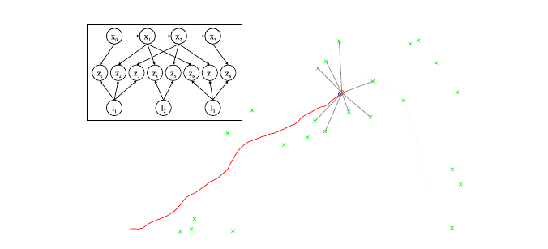
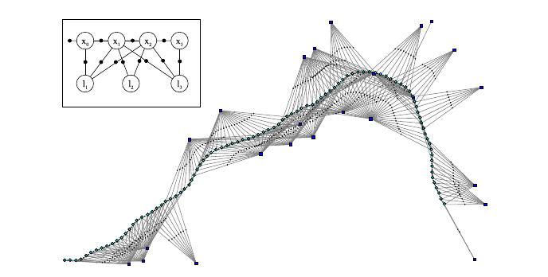
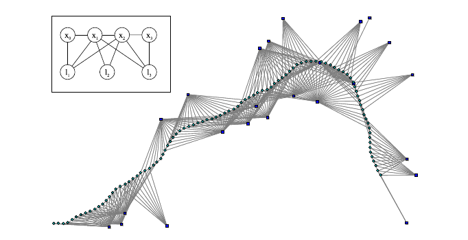
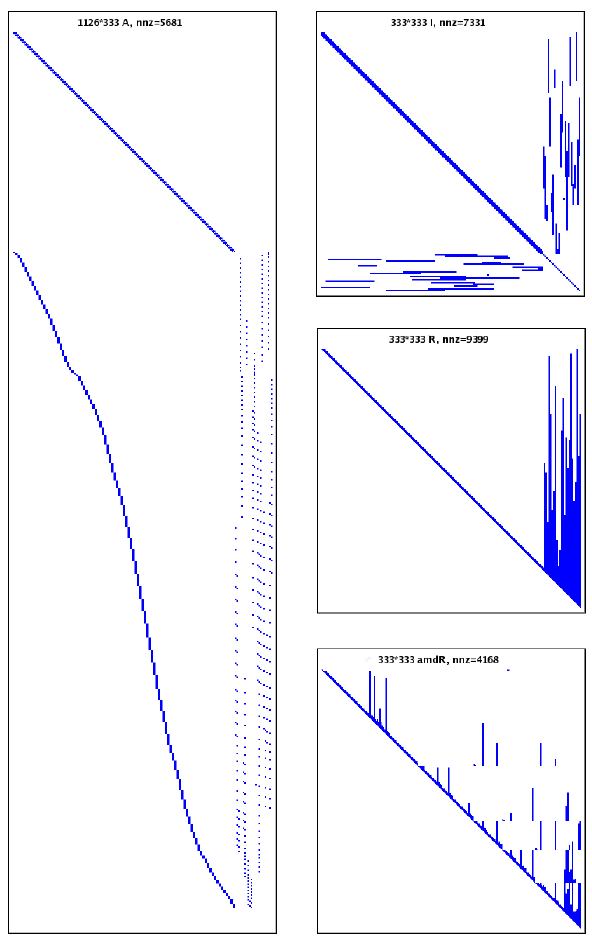
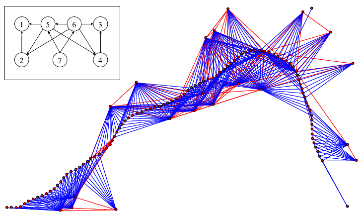

# [Paper Review] Square Root SAM (writing..)

Square Root SAM

Frank Dellaert and Michael Kaess (2006), Square Root SAM - Simultaneous Localization and Mapping via Square Root Information Smoothing. Intl. Journal of Robotics Research, 2006

## Abstract

Solving the SLAM problem is one way to enable a robot to explore, map, and navigate in a previously unknown environment. We investigate smoothing approaches as a viable alternative to extended Kalman filter-based solutions to the problem. In particular, we look at approaches that factorize either the associated information matrix or the measurement Jacobian into square root form. Such techniques have several significant advantages over the EKF: they are faster yet exact, they can be used in either batch or incremental mode, are better equipped to deal with non-linear process and measurement models, and yield the entire robot trajectory, at lower cost for a large class of SLAM problems. In addition, in an indirect but dramatic way, column ordering heuristics automatically exploit the locality inherent in the geographic nature of the SLAM problem. In this paper we present the theory underlying these methods, along with an interpretation of factorization in terms of the graphical model associated with the SLAM problem. We present both simulation results and actual SLAM experiments in large-scale environments that underscore the potential of these methods as an alternative to EKF-based approaches.

## 2. SLAM and its Graphs

### SLAM As a Belief Net
#### Figure 1
{: width="200" height="200"}{: .center}

"A belief net is as directed __acyclic graph__ that encodes the __conditional independesnce structure__ of a set of variables, where each variable __only directly depends on its predecessors in the graph__."

$$
P(X, L, Z) = P(x_0) \prod_{i=1}^{M}{P(x_i|x_{i-1}, u_i)} \prod_{k=1}^{K}{P(z_k|x_{i_k},l_{j_k})}
$$

$$P(x_0)$$ is a prior on the initial state \\
$$P(x_i|x_{i-1}, u_i)$$ is the motion model \\
$$P(z|x,l)$$ is the landmark measurement model \\

이들은 모두 landmark $$l$$에 대한 uniform prior를 가지고 있다고 가정한다.

### SLAM As a Factor Graph
#### Figure 2
{: width="200" height="200"}{: .center}

좌측 상단의 Graph를 보면, Measurement $$z$$ 가 사라진 것을 볼 수 있다.

"While belief nets are a __very natural representation to think about the generative aspect of the SLAM problem__, _factor graphs_ have a much __tighter connection with the underlying optimization problem__. As the measurements $$z_k$$ in Figure 1 are known, we are free to __eliminate them as variables__. Instead we consider them as __parameters of the joint probabliity factors__ over the _actual_ unknowns"

측정값을 식에 넣는 대신 실제 구하고자 하는 값들에 대한 joint probability factor의 parameter로 넣음으로서 bipartite graph로 변경.

$$
P(\Theta) \propto \prod_{i}{\phi_i(\theta_i)} \prod_{\{i, j\}, i<j} {\psi_{ij}(\theta_i, \theta_j)}
$$

$$\phi(\theta_i)$$ : encode a prior or a single measurement constraint at an unknown $$\theta \in \Theta$$

$$\psi_{i,j}(\theta_i, \theta_j)$$ : pairwise potentials relate to measurements or constraints that involve the relationship between two unknowns.

"Note that the second product is over pairwise cliques $$\{i,j\}$$, counted once."

Belief net 식과의 관게는 다음과 같다.

$$\phi_0(x_0) \propto P(x_0)$$ : Initial state에 대한 uncertainty \\
$$\psi_{(i-1)_i}(x_{i-1}, x_i) \propto P(x_i|x_{i-1}, u_i)$$ : Motion model \\
$$\psi_{i_k, j_k}(x_{i_k}, l_{j_k}) \propto P(z_k|x_{i_k}, l_{j,k})$$ : Landmark measurement model \\

### SLAM as a Markov Random FIeld
#### Figure 3
{: width="200" height="200"}{: .center}

"factor nodes themselves are eliminated" \\
"MRF is a fundamentally different structure from the factor graph (undirected vs bipartite)"
## 3. SLAM as a Least Squares Problem
이전까지는 모델링에 대한 내용이고, 지금부터 inference에 대해 다뤄보자.

"We are concerned with _smoothing_ rather than _filtering_, i.e., we would like to _recover the maximum a posteriori (MAP) estimate_ for the __entire trajectory__ and the __map__, given the measurements, and control inputs."

"Let us collect all unknowns in $$X$$ and $$L$$ in the vector $$\Theta$$.

$$\Theta \overset{\Delta}{=} (X, L)$$ \\
Entire trajectory : $$X \overset{\Delta}{=}\{x_i\}$$ \\
Map : $$L \overset{\Delta}{=} \{l_j\}$$ \\
Measurements : $$Z \overset{\Delta}{=} \{z_k\} $$ \\
Control Inputs : $$U \overset{\Delta}{=} \{u_i\}$$ 

MAP는 Belief net에서 다룬 식을 이용해서 다음과 같이 나타낼 수 있다.

#### Equation 5
$$
\Theta^{*} = \underset{\Theta}{argmax} \Bigg\{\sum_{i=1}^{M} \left\lVert f_i(x_{i-1}, u_i)-x_i \right\rVert_{\Lambda_i}^2 + \sum_{k=1}^{K} \left\lVert h_k(x_{i_k}, l_{j_k})-z_k \right\rVert_{\Sigma_k}^2 \Bigg\}
$$

위의 Least squares problem에서 Linearization이 불가능 한 경우 Gausse-Newton 또는 Levenberg-Marquardt method를 사용하여 풀게 된다. 하지만, 만약 위의 식에서 각 parameter들이 좋은 linearization point에 있다면, Taylor's first approximation을 통해 해를 구할 수 있다.

위의 식의 첫번째 항:

$$
f_i(x_{i-1}, u_i)-x_i \approx \big\{f_i (x_{i-1}^0, u_i)+F_i^{i-1}\delta x_{i-1} \big\} - \{x_i^0 + \delta x_i\} = \big\{ F_i^{i-1}\delta x_{i-1} - \delta x_i \big\}-a_i
$$

여기서 $$F_i^{i-1}$$은 $$x_{i-1}^0$$에서의 $$f_i(.)$$의 Jacobian matrix :

$$
F_i^{i-1} \overset{\Delta}{=}  \frac{\partial f_i(x_{i-1}, u_i)}{\partial x_{i-1}}\bigg|_{x_{i-1}^0}
$$

그리고 $$a_i$$ 는 odometry prediction error:

$$
a_i = x_i^0 - f_i(x_{i-1}^0, u_i)
$$

두번째 항도 마찬가지로 :

$$
h_k(x_{i_k}, l_{j_k}) - z_k \approx \big\{h_k(x_{i_k}^0, l_{j_k}^0) + H_k^{i_k}\delta x_{i_k} + J_k^{j_k}\delta l_{j_k} \big\} - z_k = \big\{H_k^{i_k} \delta x_{i_k} + J_k^{j_k} \delta l_{j_k} \big\} - c_k
$$

여기서 $$H_k^{i_k}$$ 와 $$J_k^{j_k}$$는 $$h_k(.)에 대한 $$각각 $$x_{i_k}^0$$ 와 $$l_{j_k}^0$$ 에서의 $$x_{i_k}$$ 와 $$l_{j_k}$$에 대한 Jacobian :

$$
H_k^{i_k} \overset{\Delta}{=} \frac{\partial h_k(x_{i_j},l_{j_k})}{\partial x_{i_k}}\bigg|_{(x_{i_k}^0, l_{j_k}^0)},~~ J_k^{j_k} \overset {\Delta}{=} \frac{\partial h_k(x_{i_j},l_{j_k})}{\partial l_{j_k}}\bigg|_{(x_{i_k}^0, l_{j_k}^0)}
$$

그리고 $$c_k$$는 measurement prediction error :

$$
c_k \overset {\Delta}{=} z_k - h_k(x_{i_k}^0, l_{j_k}^0)
$$

이와 같이 linearlization을 통해 식이 다음과 같이 변하게 된다.

원래식 :

$$
\Theta^{*} = \underset{\Theta}{argmax} \Bigg\{\sum_{i=1}^{M} \left\lVert f_i(x_{i-1}, u_i)-x_i \right\rVert_{\Lambda_i}^2 + \sum_{k=1}^{K} \left\lVert h_k(x_{i_k}, l_{j_k})-z_k \right\rVert_{\Sigma_k}^2 \Bigg\}
$$

linearlization :

$$
\delta^{*} = \underset{\delta}{argmax} \Bigg\{\sum_{i=1}^{M} \left\lVert F_i^{i-1} \delta x_{i-1} + G_i^i \delta x_i - a_i \right\rVert_{\Lambda_i}^2 + \sum_{k=1}^{K} \left\lVert H_k^{i_k} \delta x_{i_k} + J_k^{j_k} \delta l_{j_k} - c_k \right\rVert_{\Sigma_k}^2 \Bigg\}
$$

(여기서 $$\Theta$$를 왜 안쓰고 $$\delta$$를 사용했는지는 모르겠다..)

여기서 $$G_i^i = -I_{d \times d}$$로 $$d$$는 $$x_i$$의 dimension이며, 추후 matrix computation을 위해 넣은 것 같다.

여기서 신경쓰이는게 바로 $$\Lambda$$ 와 $$\Sigma$$ 인데, 이는 Mahalanobis distance를 표현하는 것으로 각각 Covariance matrix를 나타낸다. Matrix square root term인 $$\Sigma^{-1/2}$$로 Mahalanobis diatance를 다시 쓰면 :

$$
\left\lVert e \right\rVert_{\Sigma}^2 \overset {\Delta}{=} e^T\Sigma^{-1}e =  (\Sigma^{-T/2}e)^T(\Sigma^{-T/2}e) = \left\lVert \Sigma^{-T/2}e \right\rVert_2^2
$$

(중간에 Covariance matrix가 symmetric 하다는 성질을 이용한 것 같다.)

가 되며, 각 $$F_i^{i-1}, G_i^i, a_i, H_k^{i_k}, J_k^{j_k}$$에 $$\Lambda_i^{-T/2}$$와 $$\Sigma_k^{-T/2}$$를 미리 곱해줌으로서 $$\Lambda$$와 $$\Sigma$$을 제거할 수 있다:

(위의 식을 바꿔본다면... 아마 이렇게 되지 않을까?)

\delta^{*} = \underset{\delta}{argmin} \Bigg\{\sum_{i=1}^M \left\lVert \Lambda_i^{-T/2} F_i^{i-1} \delta x_{i-1} + \Lambda_i^{-T/2} G_i^i \delta x_i - \Lambda_i^{-T/2} a_i \right\rVert_2^2 + \sum_{k=1}^K \left\lVert \Sigma_k^{-T/2}H_k^{i_k} \delta x_{i_k} + \Sigma_k^{-T/2} J_k^{j_k} \delta l_{j_k} - \Sigma_k^{-T/2} c_k \right\rVert_2^2 \Bigg\}
$$

어쨌든, 각 Jacobian matrix를 A로 표현하고, prediction error, measurement prediction error인 $$a_i$$와 $$c_k$$를 b로 표현한다면, 다음과 같은 Matrix 형태의 표준 Least squares problem으로 나타낼 수 있다 :

$$
\delta^{*} = \underset{\delta}{argmin} \left\lVert A\delta - b \right\rVert_2^2
$$

여기서 $$A$$는 굉장히 빠르게 커질 수 있으나, 동시에 매우 sparse하다. 예로 state와 landmark, 그리고 measurement의 dimension이 $$d_x$$, $$d_l$$ 그리고 $$d_z$$라면, $$A$$의 크기는 $$(Nd_x + Kd_z) \times (Nd_x + Md_l)$$이 되며, 여기서 unknown $$\delta$$는 각 state와 landmark 이므로 $$(Nd_x + Md_l)\times 1$$임이 자명하고, $$b$$는 각 $$a_i$$와 $$c_k$$ vector를 하나의 column으로 나열한 것으로  $$(Nd_x + Kd_z) \times 1$$의 크기를 갖게 된다.

예로, $$M = 3$$, $$N=2$$, $$K=4$$일 때 matrix 구조는 다음과 같다. (여기서 $$F, G, H, J$$ matrix들은 원래의 값이 아니라 위와 같이 각각 $$\Lambda$$와 $$\Sigma$$가 $$-T/2$$ 제곱되어 곱해져 있다는 것을 생각해야된다.)

$$
A=\begin{bmatrix}
G_1^1 \\
F_2^1 && G_2^2\\
&& F_3^2 && G_3^3\\
H_1^1 && &&&& J_1^1 \\
H_2^1 && && && && J_2^2 \\
&& H_3^2 && && J_3^1 \\
&& && H_4^3 && && J_4^2
\end{bmatrix}, ~ b = \begin{bmatrix}
a_1\\
a_2\\
a_3\\
c_1\\
c_2\\
c_3\\
c_4
\end{bmatrix}
$$

#### Figure 4
{: width="200" height="200"}{: .center}

위의 그림은 95개의 state, 24개의 landmark에 대한 그림이며, 왼쪽 그림은 A matrix를 나타낸다. 오른쪽의 맨 위의 그림은 information matrix $$\mathcal{I} \overset{\Delta}{=} A^TA$$를 나타낸 그림이며, 가운데는 Cholesky triangle $$R$$, 그리고 아래는 __better variable ordering__ 으로 나타낸 R matrix 이다. 그렇다면 왜 이 _better variable ordering_ 이 필요할까? 아래에 서술되어있지만, $$R$$은 Junction tree와 연관되어있으며, 이런 Junction tree를 생성하는데 있어 더욱 효율적으로 나타낼 수 있다(라고 이해했다..).

## 4. A Linear Algebra Perspective
Full-rank $$m\times n $$ ($$m \geq n$$인) matrix A에 대해 unique한 Least squares 풀이는 normal equation으로 나타낼 수 있다:

$$
A^T A \delta ^{*} = A^T b
$$

이는 보통 Information matrix $$\mathcal{I}$$를 Cholesky factorization:

$$
\mathcal{I} \overset{\Delta}{=} A^T A = R^T R
$$

을 통해 구해지며, 여기서 $$R$$은 Cholesky triangle로 $$n\times n$$의 upper triangular matrix이다. 이를 구하기 위한 Cholesky factorization은  symmetric positive definite matrix에 대해서만 행해지는 LU factorization의 변형으로 볼 수 있다. Dense matrix에 대해서는 $$n^3 /3$$ flop의 계산량이 필요되며, 이를 통해 $$\delta^{*}$$는 다음과 같이 back substituion으로 구할 수 있다:

$$
first~R^Ty=A^Tb ~ and~then~R\delta^{*} = y
$$

$$A^T A$$를 게산하는 것 포함 전체 알고리즘은 $$(m+n/3)n^2$$ flops의 계산량이 필요된다.

[Figure 4](#figure-4)는 [Figure 1](#figure-1) 모델의 $$\mathcal{I}$$와 그 Cholesky triangle $$R$$이 $$A$$와 함께 나타나있다. $$A$$가 $$XL$$ ordering, 즉 trajectory $$X$$와 landmark $$L$$ 순으로 나열된 경우 $$\mathcal{I}의 모습은 주로 [Figure 4](#figure-4)와 같이 block structure를 나타낸다. :

$$
\mathcal{I}=
\begin{bmatrix}
A_X^T A_X && \mathcal{I}_{XL} \\
\mathcal{I}_{XL}^T && A_L^T A_L
\end{bmatrix}
$$

여기서 $$\mathcal{I}_{XL} \overset{\Delta}{=} A_X^T A_L$$은 robot state들 $$X$$와 map $$L$$간의 correlation을 나타내며, diagonal block들은 [band-diagonal](https://en.wikipedia.org/wiki/Band_matrix)하다.

Square root 계산을 피하는 Cholesky factorization의 변형된 방법은 lower triangular matrix $$L$$과 Diagonal matrix $$D$$를 계산하는 LDL factorization이다:

$$
\mathcal{I} = R^T R = LDL^T
$$

Cholesky decomposition보다 더 정확하고 수치적으로 더욱 안정적인 방법은 $$\mathcal{I}$$를 계산하지 않는 QR factorization이다. :

$$
Q^T A = \begin{bmatrix}
R \\
0
\end{bmatrix}
~~
Q^T b = \begin{bmatrix}
d \\
e
\end{bmatrix}
$$

여기서 $$Q$$는 $$m\times m$$의 orthogonal matrix이며, $$R$$은 upper-trianguler cholesky triangle이다. [계산방법](#a1-qr-factorization)

Orthogonal matrix $$Q$$는 대체로 형성되지 않는다. (The orthogonal matrix $$Q$$ is not usually formed를 직역한건데, 일정하지 않다는 것인지, QR Factorization이 안될수도 있다는 뜻인지 잘 모르겠다.) 대신, 우항의 $$Q^T b$$는 $$b$$를 $$A$$의 extra column으로 붙여 계산한다. $$Q$$가 orthogonal matrix이므로 다음과 같은 식이 형성된다.

$$
\left\lVert A\delta-b \right\rVert_2^2 =
\left\lVert Q^T A \delta -Q^T b\right\rVert_2^2 =
\left\lVert R \delta - d\right\rVert_2^2 +\left\lVert e \right\rVert_2^2
$$

여기서 $$\left\lVert e \right\rVert_2^2$$는 least-squares residual이며, least squares의 솔루션 $$\delta^*$$는 $$R\delta = d$$를 back-substitution으로 풀 수 있다.

이 QR factorization으로 푸는 방법의 계산량은 Householder reflection에 대부분 쓰인다. ($$2(m-n/3)n^2$$).

$$m \gg n$$일때는 QR과 Cholesky factorization 모두 $$O(mn^2)$$의 계산량이 필요하지만, QR이 2배 느리다. 하지만, __sparse matrix에__ 대해서는 __LDL과 Cholesky factorization이 QR 보다 훨씬 성능이 좋음을__ 알 수 있었다고 한다.

## 5. A Graphical Model Perspective

### Matrices <-> Graphs
위의 설명에서 우리는 Jacobian $$A$$가 SLAM과 관련된 factor graph의 matrix임을 알 수 있다. 이는 다음 두가지로 설명이 가능하다.

1. __$$A$$의 모든 block은 least-squares의 각 term을 나타낸다__ : 
landmark measurement이나 odometry constraint이나, 각 block-row는 factor graph의 하나의 factor와 연결된다. 때문에 sparcity pattern은 알지 못하는 pose와 landmark간의 factor를 나타낸다. 따라서 $$A$$의 block structure는 factor graph의 adjancency matrix에 해당된다. (무슨 소리인지 모르겠다)
2. __Scalar level에서, $$A$$의 각 row $$A_i$$는 scalar term $$\left\lVert A_i\delta - b_i\right\rVert_2^2$$에 해당된다__ :

$$
\left\lVert A\delta-b\right\rVert_2^2 = \sum_i \left\lVert A_i\delta - b_i \right\rVert_2^2
$$

따라서, 이는 _finely structured factor graph_ 를 다음과 같이 형성한다.

$$
P(\delta) \propto exp -\frac{1}{2} \left\lVert A\delta-b\right\rVert_2^2 = 
\prod_i exp -\frac{1}{2}\left\lVert A_i\delta - b_i\right\rVert_2^2
$$

(정확히 말한다면 $$\left\lVert A_i\delta_i - b_i\right\rVert_2^2$$ 아닌가..?)

이 finer view에서 __SLAM의 block structure가 버려지고, 이 graph가 일반적인 linear algebra 방법으로__ 바뀌었다는 점이 중요하다. 

Information matrix $$\mathcal{I}$$는 SLAM 문제를 다룬 Markov random field의 matrix이다. 서술한 바와 같이 $$A^TA$$의 sparsity pattern은 MRF의 _adjacency matrix_이다. [Equation 5](#equation-5)의 objective function은 Hammersley-Clifford theorem으로 pairwise Markov random field에 해당되며, MRF상의 node들은 robot state들과 landmark들에 해당되고, link들은 odometry나 measurement에 해당된다.

기존 논문들(본문의 \[65, 78\] reference)에서는 MRF graph를 __filtering version of SLAM의__ 에 내지된 correlation structure 를 부각시키는 것으로 보여졌으며, 여기서 기존 trajectory $$X_{1:M-1}$$를 marginalizing (네이버는 소외시키다로 나오는데, 수학적으로는 확률적으로 포함하다로 해석하면 될 것 같다. 다른 의미가 아닌가 싶을텐데, 이 확률적으로 포함하는 과정에서 세세한 부분을 버리고 기존 값들을 마지막 state에 포함시킨다던가.. 그런 식으로 '소외' 시키는 것으로 보면 될 것 같다.)할 경우, information matrix는 굉장히 dense해진다. 그래서 이 논문들은 link를 제거하여 computational cost를 줄이는 방법에 대해 강조한다.

__그 반대로, 이 논문에서는 MRF를 sparcity를 유지하는 smoothing information matrix $$I$$로 해석하여 기존 state들이 marginalized out되지도 않는 방법을 제안한다.__

### Factorization <-> Variable Elimination

#### Figure 5

그렇다면 $$R$$은 어떤 graph에 해당되는 것일까? 

{: width="200" height="200"}{: .center}

### Improving Performance <-> Reducing Fill-in

## Square Root SAM

### Batch $$\sqrt{SAM}$$

### Linear Incremental $$\sqrt{SAM}$$

### Non-linear Incremental $$\sqrt{SAM}$$

### A1 QR factorization

Dense matrix $$A$$에 대하여 $$R$$을 좌에서 우로 column별로 계산한다. Column $$j$$에 대하여 모든 diagonal 아래의 non-zero element들은 $$A$$의 좌측에 _Householder reflection matrix_ $$H_j$$를 곱합으로서 0으로 만든다:

$$
H_n ... H_2 H_1 A = Q^T A = \begin{bmatrix}
R\\
0
\end{bmatrix}
$$