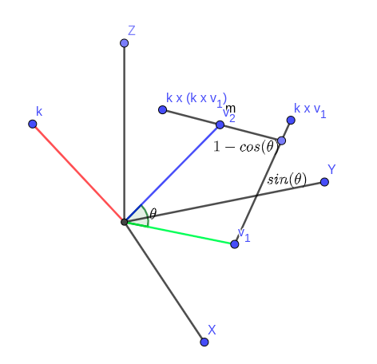

# Getting the rotation matrix between vectors

Let's find a rotation matrix which rotates a unit vector $$\mathbf{v}_1$$ to a unit vector $$\mathbf{v}_2$$

We can think about a vector $$\mathbf{k} = \mathbf{v}_1 \times \mathbf{v}_2$$, which can also be expressed as $$\mathbf{k} = [\mathbf{v}_1]_\times\mathbf{v}_2$$

where $$[\mathbf{v}_1]_\times$$ is a skew-symmetric matrix:

$$
[\mathbf{v}_1]_\times = \begin{bmatrix}
0 & -v_{1_3} & v_{1_2} \\
v_{1_3} & 0 & -v_{1_1} \\
-v_{1_2} & v_{1_1} & 0
\end{bmatrix}
$$

From vector products, we can get the cosine and sine value of the angle between the vectors (geodesic angle), $$\theta$$ as:

$$
\begin{align*}
cos(\theta) &= \mathbf{v}_1 \cdot \mathbf{v}_2\\
sin(\theta) &= \lVert \mathbf{v}_1\times \mathbf{v}_2 \rVert = \lVert \mathbf{k} \rVert
\end{align*}
$$

From the figure below, we can figure out that

$$
\mathbf{v}_2 = \mathbf{v}_1 + sin(\theta)(\mathbf{k}\times\mathbf{v}_1)+(1-cos(\theta))(\mathbf{k}\times(\mathbf{k}\times\mathbf{v}_1))
$$

which can be expressed in a matrix form

$$
\begin{align*}
&\mathbf{v}_2 = \mathbf{v}_1 + sin(\theta)([\mathbf{k}]_\times\mathbf{v}_1)+(1-cos(\theta))([\mathbf{k}]_\times([\mathbf{k}]_\times\mathbf{v}_1))\\
=&(I+sin(\theta)[\mathbf{k}]_\times+(1-cos(\theta))[\mathbf{k}]_\times^2)\mathbf{v}_1
\end{align*}
$$

Since we want to find a rotation matrix $$R$$ which satisfies $$R\mathbf{v}_1 = \mathbf{v}_2$$, $$R$$ can be expressed as:

$$
R = I + sin(\theta)[\mathbf{k}]_\times + (1-cos(\theta))[\mathbf{k}]_\times^2
$$